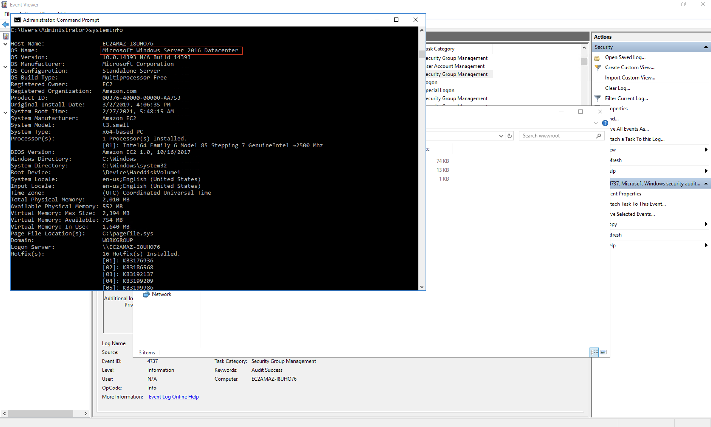
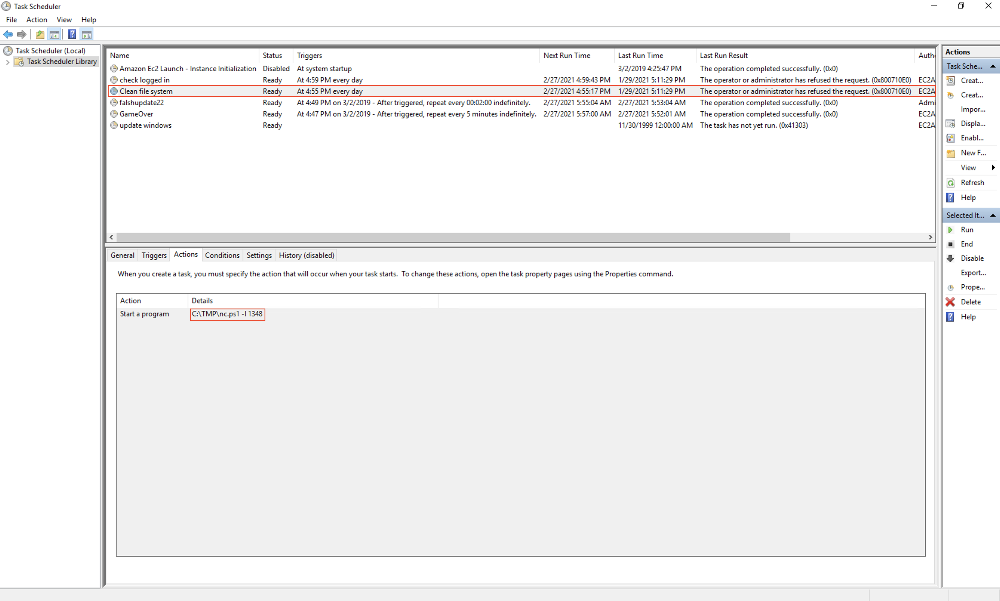
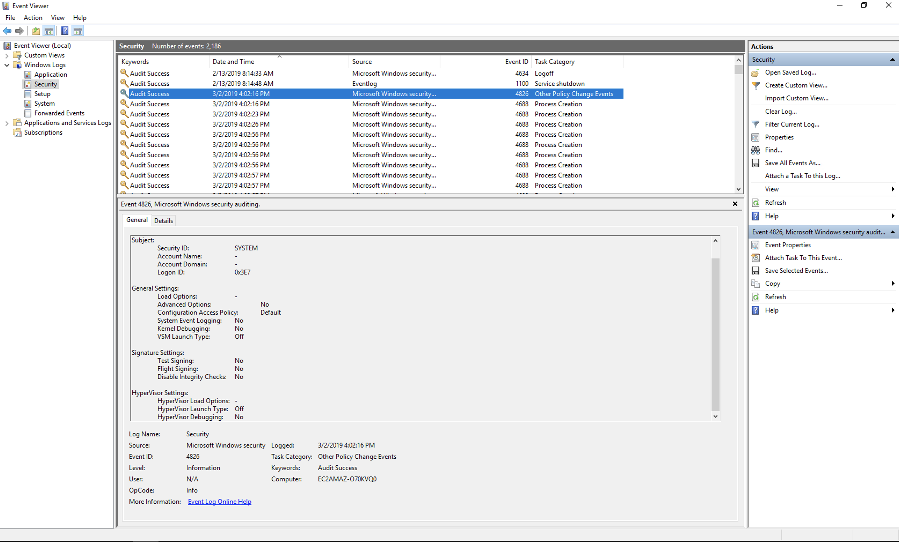
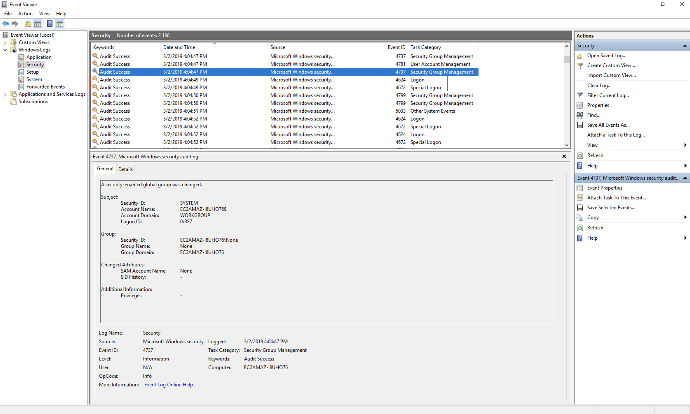
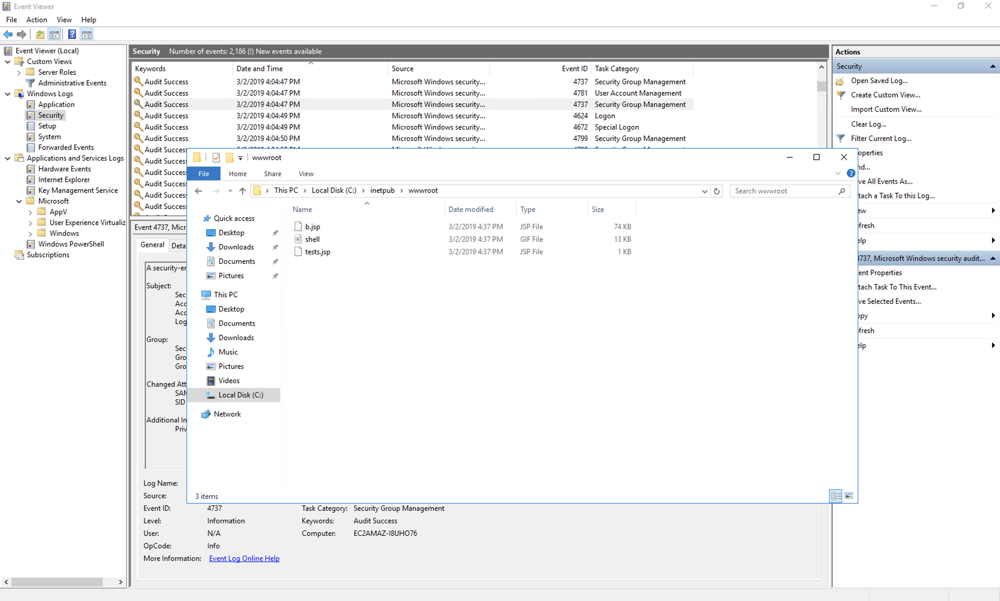
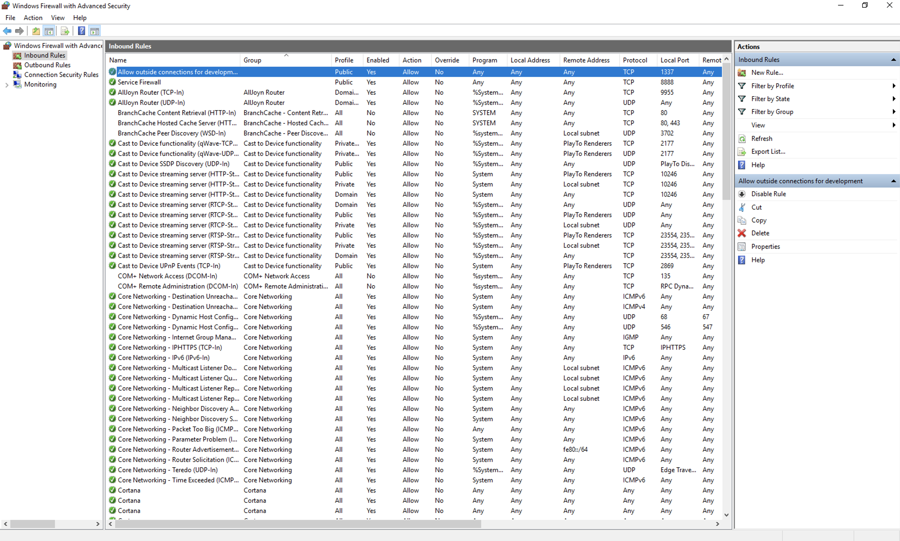

# Investigating Windows

https://tryhackme.com/room/investigatingwindows

## Category

Forensics

## Question

This is a challenge that is exactly what is says on the tin, there are a few challenges around investigating a windows machine that has been previously compromised.

Connect to the machine using RDP. The credentials the machine are as follows:

Username: Administrator
Password: letmein123!

Please note that this machine does not respond to ping (ICMP) and may take a few minutes to boot up.


## Solution

### What's the version and year of the windows machine?
To check that simply type in ```systeminfo``` in command prompt to get windows version.


### Which user logged in last?
As you are the last person to login the username should be Administrator.

### When did John log onto the system last?
### Answer format: MM/DD/YYYY H:MM:SS AM/PM
John's last login details can be grabbed using the following command from cmd.
```net user john | findstr /B /C:"Last logon"```

### What IP does the system connect to when it first starts?


### What two accounts had administrative privileges (other than the Administrator user)?
### Answer format: username1, username2
Details of each user account can be found out via the command

```console
Administrator>net user

User accounts for \\EC2AMAZ-I8UHO76

-------------------------------------------------------------------------------
Administrator            DefaultAccount           Guest
Jenny                    John
The command completed successfully.

Administrator>net user jenny

Administrator>net user guest
```

### Whats the name of the scheduled task that is malicous.
### What file was the task trying to run daily?
### What port did this file listen locally for?


### When did Jenny last logon?
Again net user jenny command can be used to check last login of jenny via command prompt.

```console
Administrator>net user jenny
User name                    Jenny
Full Name                    Jenny
Comment
User's comment
Country/region code          000 (System Default)
Account active               Yes
Account expires              Never

Password last set            3/2/2019 4:52:25 PM
Password expires             Never
Password changeable          3/2/2019 4:52:25 PM
Password required            Yes
User may change password     Yes

Workstations allowed         All
Logon script
User profile
Home directory
Last logon                   Never
```

### At what date did the compromise take place?
### Answer format: MM/DD/YY
This can be correlated to the event when a lot of processes gets suddenly started that can be viewed via event viewer.



### At what time did Windows first assign special privileges to a new logon?
### Answer format: MM/DD/YYYY HH:MM:SS AM/PM
From the event viewer, the date and time can be sorted from latest to oldest event to check when there has been an escalated logon to the system on 03/02/2019.


### What tool was used to get Windows passwords?
There was an intermittent command prompt popup execution that was holding a mimikatz session.

### What was the attackers external control and command servers IP?
This can be checked by finding the hosts configuration file within the C drive.


### What was the extension name of the shell uploaded via the servers website?
This can be checked by looking at the www root path of IIS.


### What was the last port the attacker opened?


### Check for DNS poisoning, what site was targeted?
As seen in the hosts file, google was targeted for DNS poisoning.


## Improvement
None


