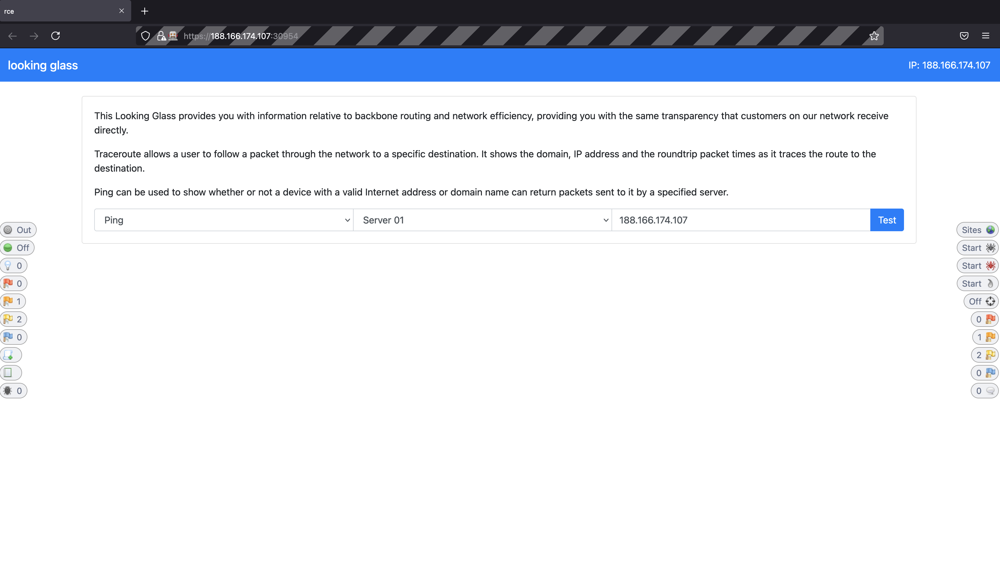
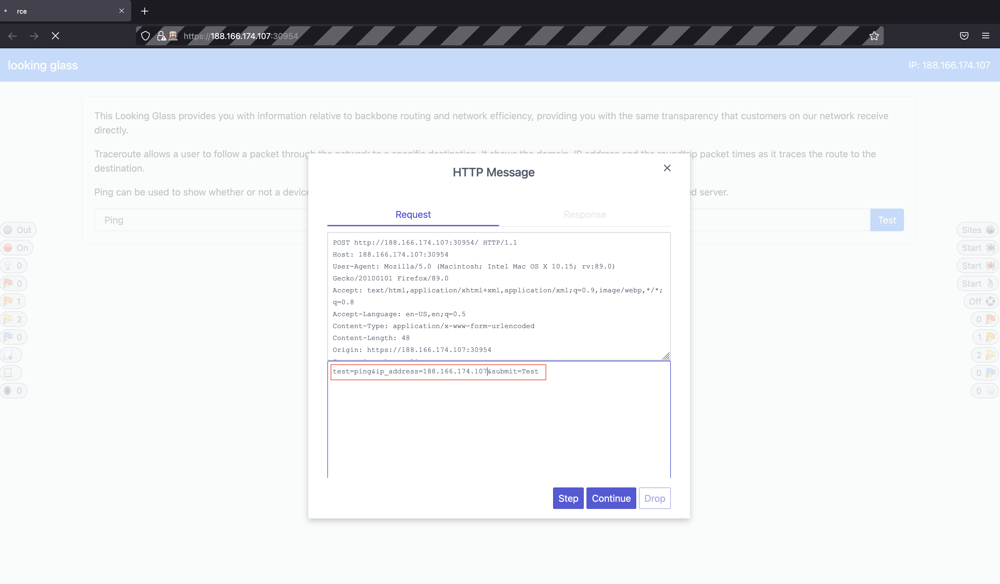
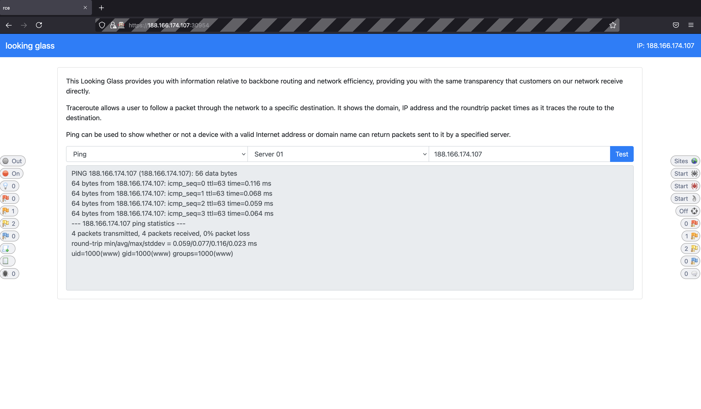
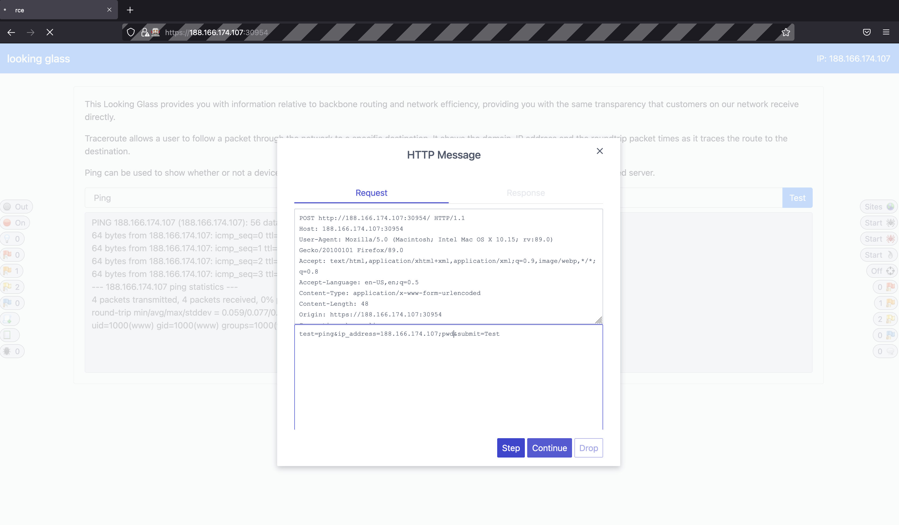
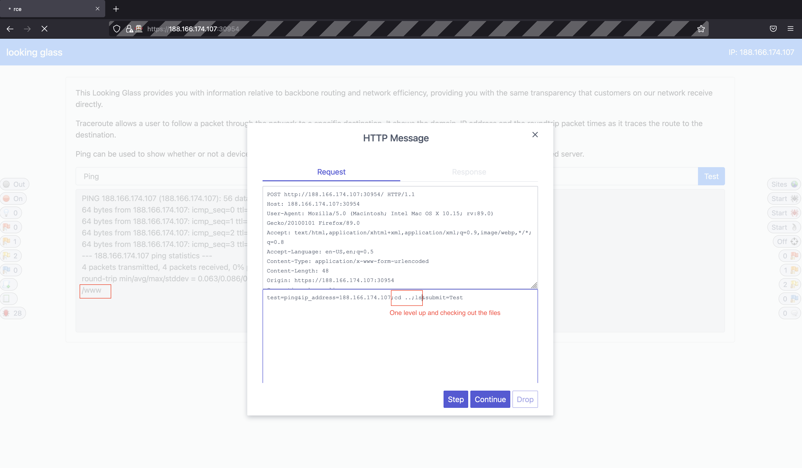
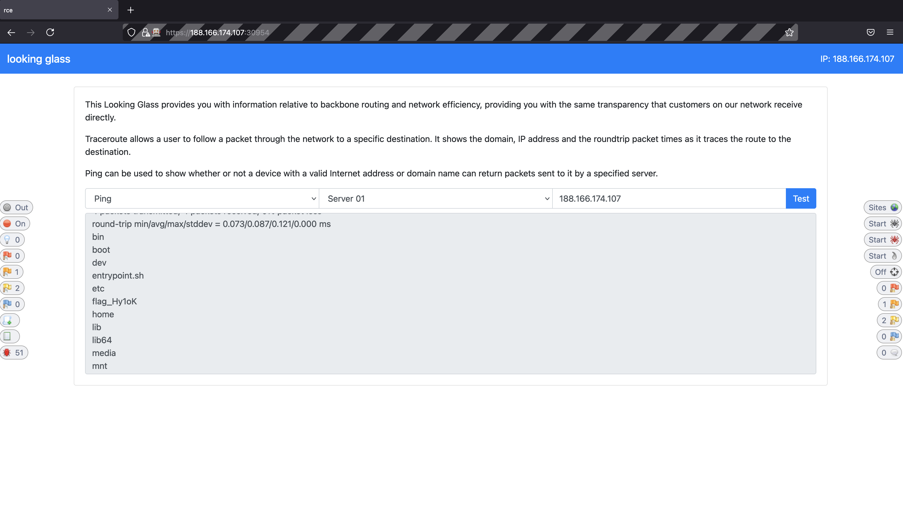
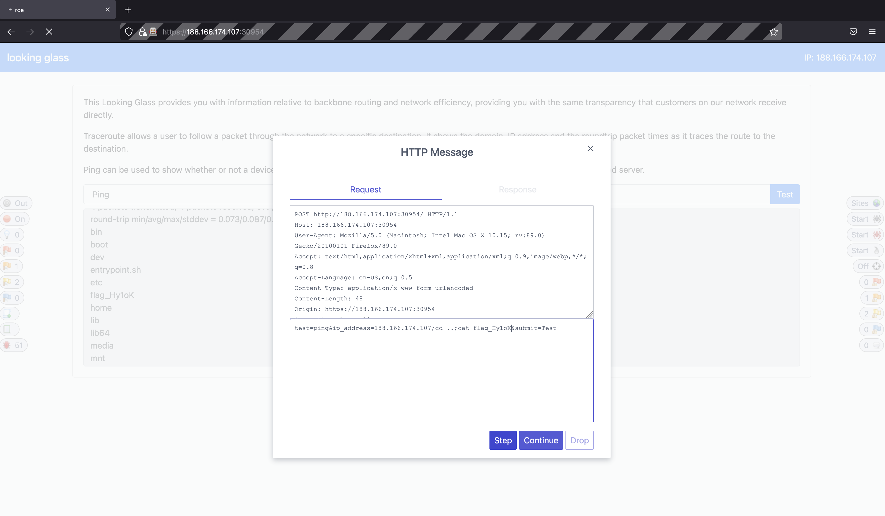
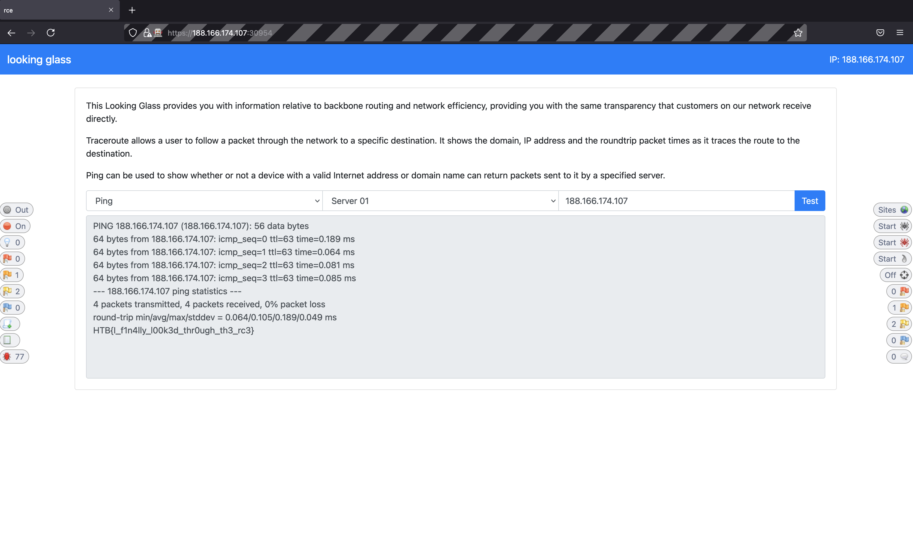

# Looking Glass HTB Firewalker CTF

 
https://ctf.hackthebox.com/ctf/240
Point: 325

## Category

Web-Exploitation

## Question

We've built the most secure networking tool in the market, come and check it out!


## Solution
This challenge is a remote code execution vulnerability challenge. You are given a web page to test out networking tool namely ping and traceroute.
The web page is quickly popped in Owasp ZAP to recon the requests and responses to and from the server.


A breakpoint is set to examine the request further.


From the request we can see that a request for ping is sent to server in the following format.
```test=ping&ip_address=188.166.174.107&submit=Test```

A test injection command is crafted in the command as below to see if the request would be vulnerable to remote code execution on the server.

```test=ping&ip_address=188.166.174.107;id&submit=Test```

Indeed, the web application is vulnerable to an RCE from the response.


Another test command is crafted to further recon the context of the environment we're in.


The command again shows that we are in www directory of the server.


We can see from here that there is a flag file one level up from www directory of the server.


The command is again crafted further to read the contents of the flag file.


The output of the contents are then shown in the output pane of the looking glass web application.


## Improvement

None